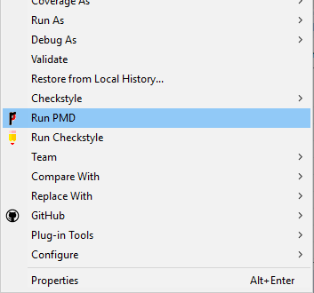
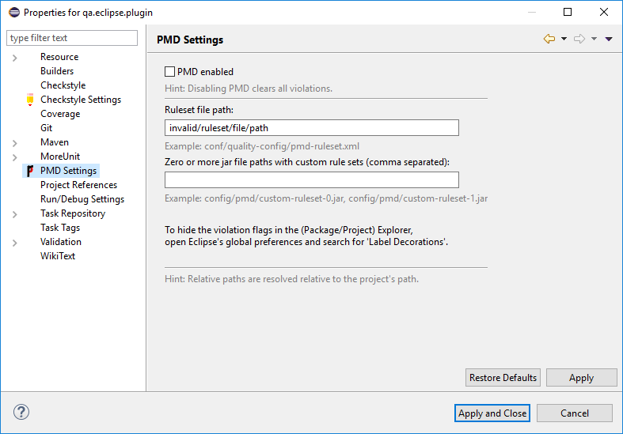

[](https://github.com/ChristianWulf/qa-eclipse-plugin/issues)
[](https://github.com/ChristianWulf/qa-eclipse-plugin/blob/master/LICENSE)
[](http://build.se.informatik.uni-kiel.de/jenkins/job/qa-eclipse-plugin-pipeline/)

# Lightweight Eclipse Plugin for Quality Assurance Tools
The offical Eclipse plugins for PMD and Checkstyle work great...as long as you do not want to add custom rules or checks, respectively. For this purpose, you need to implement an Eclipse Plugin Fragment including the new rules/checks. This causes an unnecessarily high implementation effort and hampers the setup of a common, uniform QA configuration for each of your team members. 

Hence, I implemented a new plugin, which covers all of the matured QA tools, and allows an easy integration of custom rules/checks via a config file. Eclipse Plugin Fragments are not necessary. You can keep your QA config files and use them for your build tool, your continuous integration infrastructure, and within Eclipse.

- Done: PMD, Checkstyle
- In progress: Spotbugs (formerly Findbugs) 
- Planned: nothing else, so far.

 See our [associated milestones](https://github.com/ChristianWulf/qa-eclipse-plugin/milestones).

## Usage
The plugin provides for each QA tool:
- a command entry in the context menu (a.k.a. right-click menu) to execute the tool (example: "Run PMD")
  
  
- a view to display the issues detected by the tool. This view needs to be opened manually via 
  > ``"Window -> Show View -> Other..."``
  
  A double-click on a violation in this view opens the corresponding file in the editor and jumps to the associated line of code.
  
  
- a property page for each project (example: "PMD Settings"). This page allows to configure the tool.
  
  

## Configuration
The plugin expects a dedicated "prefs" file in the directory ".settings" of the Eclipse project, you like to check for issues. This file is created automatically if you press the "apply" button on the corresponding property page.

The property page allows
- to enable/disable the tool for the project, 
- to define the path to the tool's xml configuration file, and
- to define the path(s) to the jar file(s) containing your custom rules/checks. 

The "prefs" file is intended to be uploaded to your repository to share your configuration with your team.

**IMPORTANT** The version of the API used for your custom rules/checks must be compatible with the version of the tool included in this Eclipse plugin.
- The version of PMD included in this plugin can be found [here](bundles/pmd/lib).
- The version of Checkstyle included in this plugin can be found [here](bundles/checkstyle/lib)

## Install
- via Eclipse Updatesite:
  - Snapshot version: https://build.se.informatik.uni-kiel.de/eus/qa/snapshot/
  - Release version: not yet available

## Build
- via Maven 3.3 or above (necessary for pom-less building):
```
mvn clean package
```

## Local Development
1. Build *qa.eclipse.plugin* via `mvn clean package`
2. Copy the three build artifacts from
- `qa-eclipse-plugin/bundles/XXX/target/qa.eclipse.plugin.bundles.XXX-1.0.0-SNAPSHOT.jar` (where XXX is supposed to be `common`, `checkstyle`, and `pmd`) to your Eclipse installation folder:      
- `Path/To/Eclipse/dropins/plugins` (You might need to create the `plugins` folder
3. Start Eclipse via the clean flag, e.g., `./eclipse -clean` on Linux. The clean flag is used to clean Eclipse's plugin cache.
4. In Eclipse, check if the plugin is installed. Check if *Window -> Show View -> Other... -> Quality Assurance* is available.
